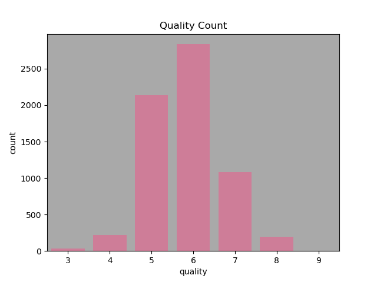
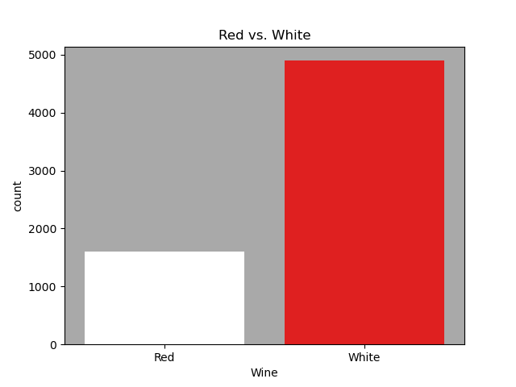
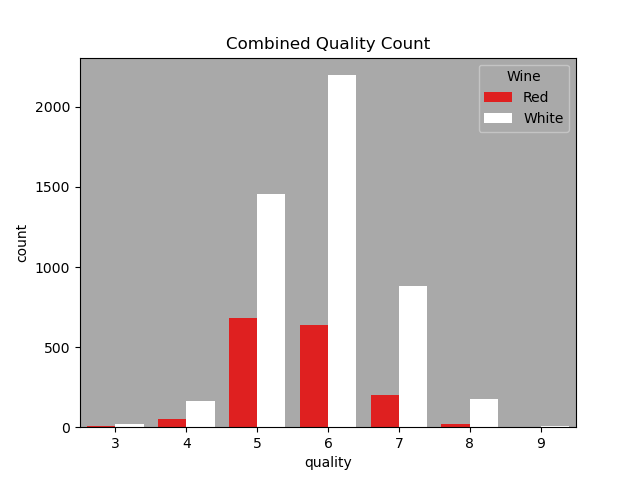
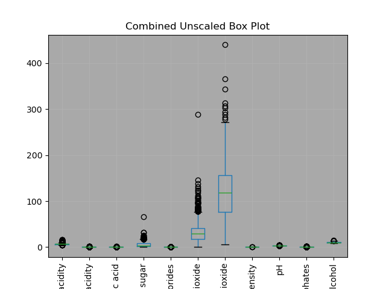
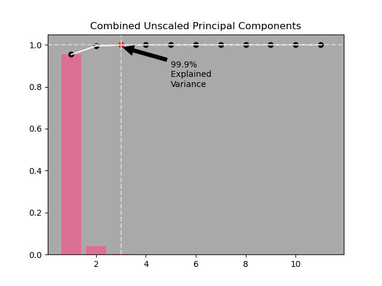
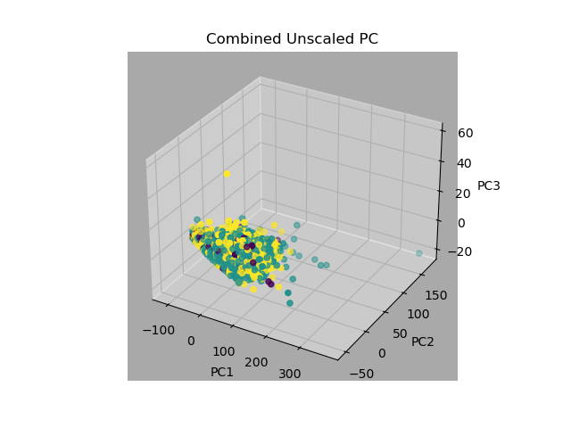
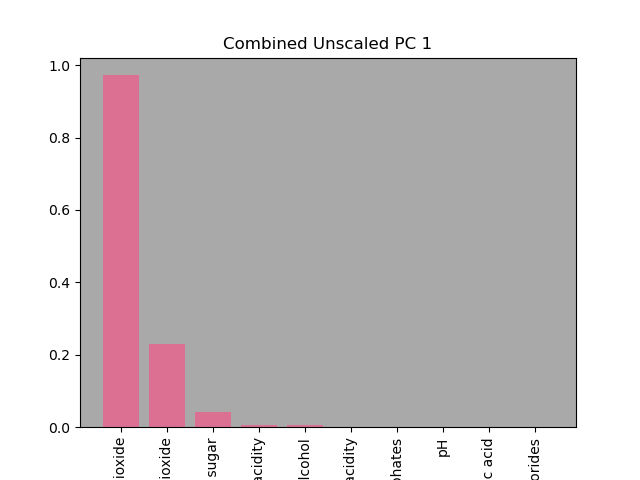

### Exploratory Data Analysis

**Our task is to develop a model that predicts the quality of wine based on a predetermined scale. This section will highlight the relevant aspects of the data used to generate this model.**

### Dataset

#### Column                           Non-Null Count     Dtype 
**Data columns (total 13 columns):**
---  ------                --------------    -----  
 **0   fixed acidity         6497 non-null     float64
 1   volatile acidity      6497 non-null     float64
 2   citric acid           6497 non-null     float64
 3   residual sugar        6497 non-null     float64
 4   chlorides             6497 non-null     float64
 5   free sulfur dioxide   6497 non-null     float64
 6   total sulfur dioxide  6497 non-null     float64
 7   density               6497 non-null     float64
 8   pH                    6497 non-null     float64
 9   sulphates             6497 non-null     float64
 10  alcohol               6497 non-null     float64
 11  quality               6497 non-null     int64  
 12  Wine                  6497 non-null     object** 

    fixed   volatile   citric   residual   chlorides      free      total      density     pH     sulphates   alcohol   quality    Wine
            acidity     acid      sugar                  sulfur     sulfur
                                                        dioxide     dioxide     
    7.0      0.27       0.36      20.7       0.045        45.0       170.0      1.0010    3.00      0.45        8.8        6        White
    6.3      0.30       0.34       1.6       0.049        14.0       132.0      0.9940    3.30      0.49        9.5        6        White
    8.1      0.28       0.40       6.9       0.050        30.0       97.0       0.9951    3.26      0.44       10.1        6        White
    7.2      0.23       0.32       8.5       0.058        47.0       186.0      0.9956    3.19      0.40        9.9        6        White
    7.2      0.23       0.32       8.5       0.058        47.0       186.0      0.9956    3.19      0.40        9.9        6        White
   
   
**The '*Wine*' is classified in two categories 'Red' & 'White' and graded on a '*quality*' scale from 3-9. There are 13 descriptive features with 6497 samples non of which are null as noted above.** 
   
### **Class imbalance **  
 
 
 
   
 
 
 
 
 
 
**The figures above point out a extreme imbalance, approximately 3(white) to 1(red) in '*Wine*' type category and a heavy concentration on central scores in the '*quality*' scale which will complicate the training process of the propective models hindering predictive performance.**
 
 
 
 ### **PCA**
 
 
 
 
 
 

**The boxplot shows that with unscaled data the preponderant features are  'free sulfur dioxide' & 'total sulfur dioxide' which holds true in the individual plots for the red and white categories as well.**
 
 
 

                PC1 top 3 feautres are 

                                                                                      total sulfur dioxide    0.972167
                                                                                      free sulfur dioxide     0.230482
                                                                                      residual sugar          0.041020
                                                                                      

**After the PCA 99.9% of the variance can be explained with 3 principal components
 
 
 
 
 
 
 
 
 
 
 
 
 
 
 
 
 
 
 
 
 
 
 
 
 
 
 
 
 
 
 
 
 