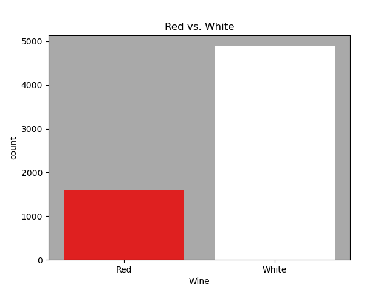
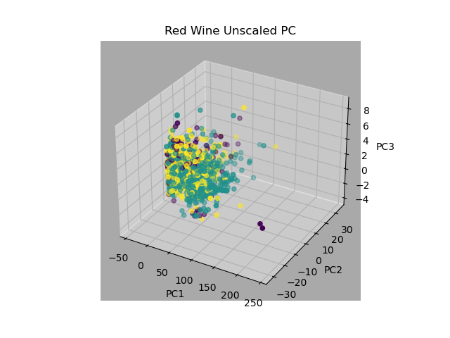
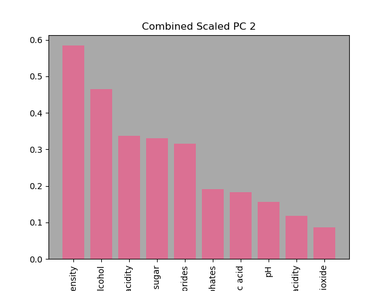

### Exploratory Data Analysis

**Our task is to develop a model that predicts the quality of wine based on a predetermined scale. This section will highlight the relevant aspects of the data used to generate this model.**

### Dataset

#### Column                           Non-Null Count     Dtype 
                    Data columns (total 13 columns):
                    ---  ------                --------------    -----  
                    0   fixed acidity         6497 non-null     float64
                    1   volatile acidity      6497 non-null     float64
                    2   citric acid           6497 non-null     float64
                    3   residual sugar        6497 non-null     float64
                    4   chlorides             6497 non-null     float64
                    5   free sulfur dioxide   6497 non-null     float64
                    6   total sulfur dioxide  6497 non-null     float64
                    7   density               6497 non-null     float64
                    8   pH                    6497 non-null     float64
                    9   sulphates             6497 non-null     float64
                    10  alcohol               6497 non-null     float64
                    11  quality               6497 non-null     int64  
                    12  Wine                  6497 non-null     object** 
 
 

#### Data Frame

    fixed   volatile   citric   residual   chlorides      free      total      density     pH     sulphates   alcohol   quality    Wine
            acidity     acid      sugar                  sulfur     sulfur
                                                        dioxide     dioxide     
    7.0      0.27       0.36      20.7       0.045        45.0       170.0      1.0010    3.00      0.45        8.8        6        White
    6.3      0.30       0.34       1.6       0.049        14.0       132.0      0.9940    3.30      0.49        9.5        6        White
    8.1      0.28       0.40       6.9       0.050        30.0       97.0       0.9951    3.26      0.44       10.1        6        White
    7.2      0.23       0.32       8.5       0.058        47.0       186.0      0.9956    3.19      0.40        9.9        6        White
    7.2      0.23       0.32       8.5       0.058        47.0       186.0      0.9956    3.19      0.40        9.9        6        White
   
   
**The '*Wine*' is classified in two categories 'Red' & 'White' and graded on a '*quality*' scale from 3-9. There are 13 descriptive features with 6497 samples non of which are null as noted above.** 
   
### **Class imbalance**  
 
 
 
   
 
 
 
 
 
 
**The figures above point out a extreme imbalance, approximately 3(white) to 1(red) in '*Wine*' type category and a heavy concentration on central scores in the '*quality*' scale which will complicate the training process of the propective models hindering predictive performance.**
 
---
---
 
 ### **PCA  Unscaled**
 
 
 
 
 
 

**The boxplot shows that with unscaled data the preponderant features are  'free sulfur dioxide' & 'total sulfur dioxide' which holds true in the individual plots for the red and white categories as well.**
 
 
 

**After the PCA 99.9% of the variance can be explained with 3 principal components out of which PC 1 exerts the most influence as we can see from the scatter plot above , 'total sulfur dioxide' bears the main resposability for it as shown In the feature breakdown of PC 1 below.**
 

                

                      
                      
 
 
 

                      
                      
                        PC1 top 3 feautres are 

                      total sulfur dioxide    97.2%
                      free sulfur dioxide     23.04%
                      residual sugar           4.1%
                                                           
---                                                           

### **White Wines**

                

                      
                      
 
 
 

                      PC1 top 3 feautres are 

                     total sulfur dioxide    96.38%
                     free sulfur dioxide     26.19%
                     residual sugar           4.73%

---

### **Red Wines**

                

                      
                      
 
 
 

                        PC1 top 10 feautres are 

                       residual sugar          99.52%
                       alcohol                  8.27%
                       total sulfur dioxide     4.29%

**When examining the wine categories individually almost all of the variance can be explained by first principal component PC 1 , and like the combined data set in white wines 'total sulfur dioxide' weilds significant sway  within it as oposed to the red wines where 'residual sugar' is the feature with the most impact.**

---
---

### **PCA  Scaled**

 
 
 
 
 
 
 
 
 
 
 
 
 
 
 
 
 
 **After scaling the increased number of outliers in every feature is evident in contrast with the unscaled data, also PCA shows that the explained variance will now need most of the principal components to account for it, although as in the unscaled data 'total sulfur dioxide' and 'free sulfur dioxide' impact the first PCs but are relagated by 'citric acid', sulphates and 'chlorides' in the rest. Listed below are the first 5 PCs with there most impactful features.**
 
 

 
 
 
 
 
 
                         PC1 top 9 feautres are 

                        total sulfur dioxide    48.74%
                        free sulfur dioxide     43.09%
                        volatile acidity        38.07%
                        residual sugar          34.59%
 
 

                         PC2 top 9 feautres are 

                        total sulfur dioxide    56.94%
                        free sulfur dioxide     51.35%
                        alcohol                 38.61%
                        volatile acidity        27.49%

                     PC3 top 9 feautres are 

                    citric acid             59.05%
                    pH                      45.53%
                    fixed acidity           43.43%
                    volatile acidity        30.72%

                   
                   
                   
                   
                   
                   
                   
                   
                   PC4 top 9 feautres are 

                  sulphates               64.05%
                  pH                      41.45%
                  free sulfur dioxide     35.72%
                  citric acid             26.43%

                   PC5 top 9 feautres are 

                  chlorides               61.43%
                  pH                      45.33%
                  residual sugar          35.33%
                  density                 30.65%

 
 
 
 ---
 
 ### White Wines
 
 
 
 
 
 
 
 
 
 
 
 
                     PC1 top 9 feautres are 

                    density                 51.15%
                    alcohol                 43.72%
                    residual sugar          42.74%
                    total sulfur dioxide    40.66%
                    free sulfur dioxide     30.03%
 
 
 
 
 
 

                     PC2 top 9 feautres are 

                    fixed acidity           58.75%
                    pH                      58.13%
                    citric acid             34.52%
                    free sulfur dioxide     29.03%
                    total sulfur dioxide    24.40%
 
 
 
 
 
 
 
 
 
 
 
 
                      PC3 top 9 feautres are 

                    volatile acidity        59.09%
                    citric acid             50.43%
                    sulphates               43.32%
                    free sulfur dioxide     27.94%
                    residual sugar          21.43%
 
 
 
 
 
 
 
 
 
 **It is important to note that when looking at the scaled white wines data by itself although as expected it takes a greater number of principal components to account for the explained variance the features that exert dominance within the PCs have changed as we can see above, relagating 'total sulfur dioxide' and 'free sulfur dioxied' to 3rd and 4th place.**

 
 
 
 
 
 ---
 
 
 ### Red Wines
 
 
 
 
 
 
 
 
 
 
                     
                     
                     
                     PC1 top 9 feautres are 

                    fixed acidity          48.93%
                    citric acid            46.36%
                    pH                     43.85%
                    density                39.53%

 
 
 
 
 
 
 
 
 
 
 
         
         
                    PC2 top 9 feautres are 

                   total sulfur dioxide    56.94%
                   free sulfur dioxide     51.35%
                   alcohol                 38.61%
                   volatile acidity        27.49%
                   residual sugar          27.20%

 
 
 
 
 
 
 
                    PC3 top 9 feautres are 

                  alcohol                 47.16%
                  volatile acidity        44.99%
                  free sulfur dioxide     42.87%
                  density                 33.88%
                  total sulfur dioxide    32.24%
 
 
 
 
 
 
**After scaling like in the white wines the features which influenced the principal components changed in this case 'residual sugars' effect was greatly reduced by scaling  to the point that it was relegated to 5th place on PC 2. It appears that scaling could have an impact on model development, it will depend model behavior and performance.**
 
 
 
 
 
 
 
 
 
 
 
 
 
 
 
 
 
 
 
 
 
 
 
 
 
 
 
 
 
 
 