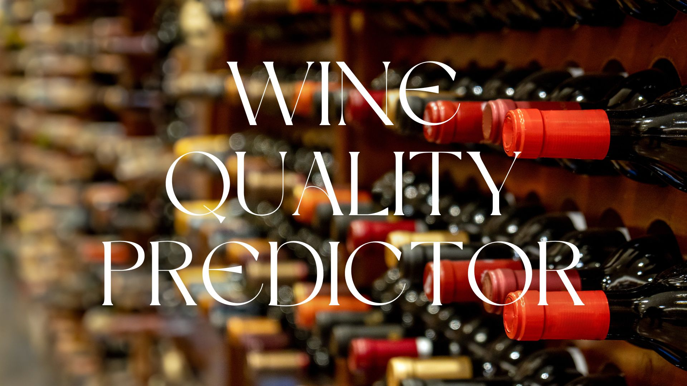
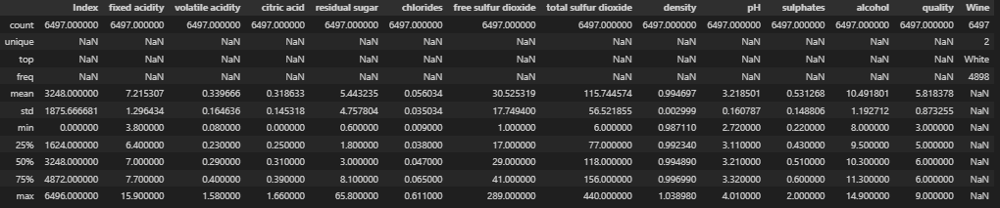
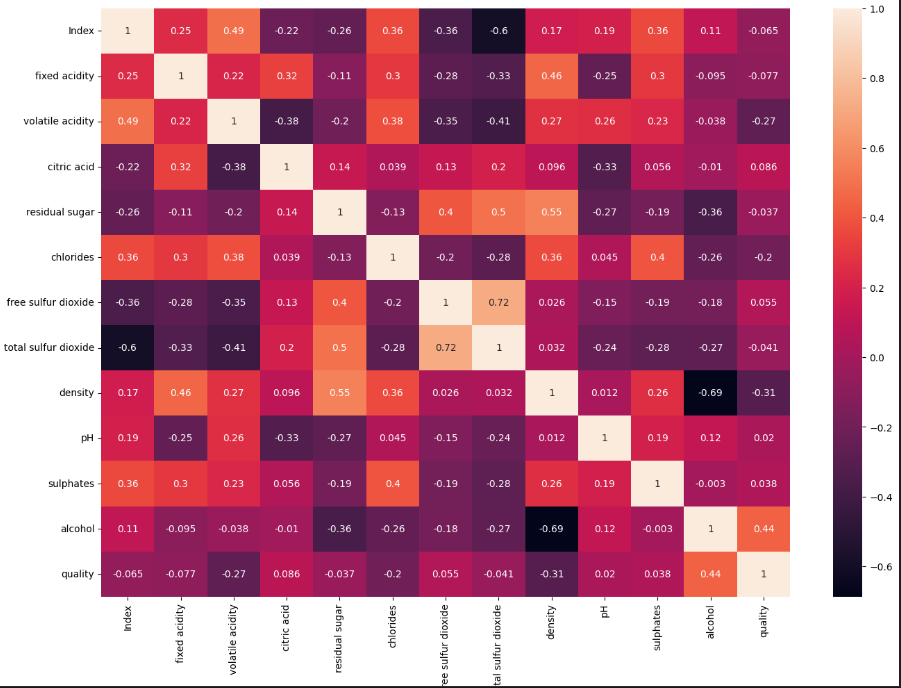
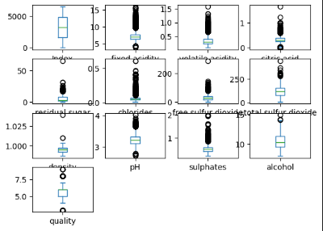
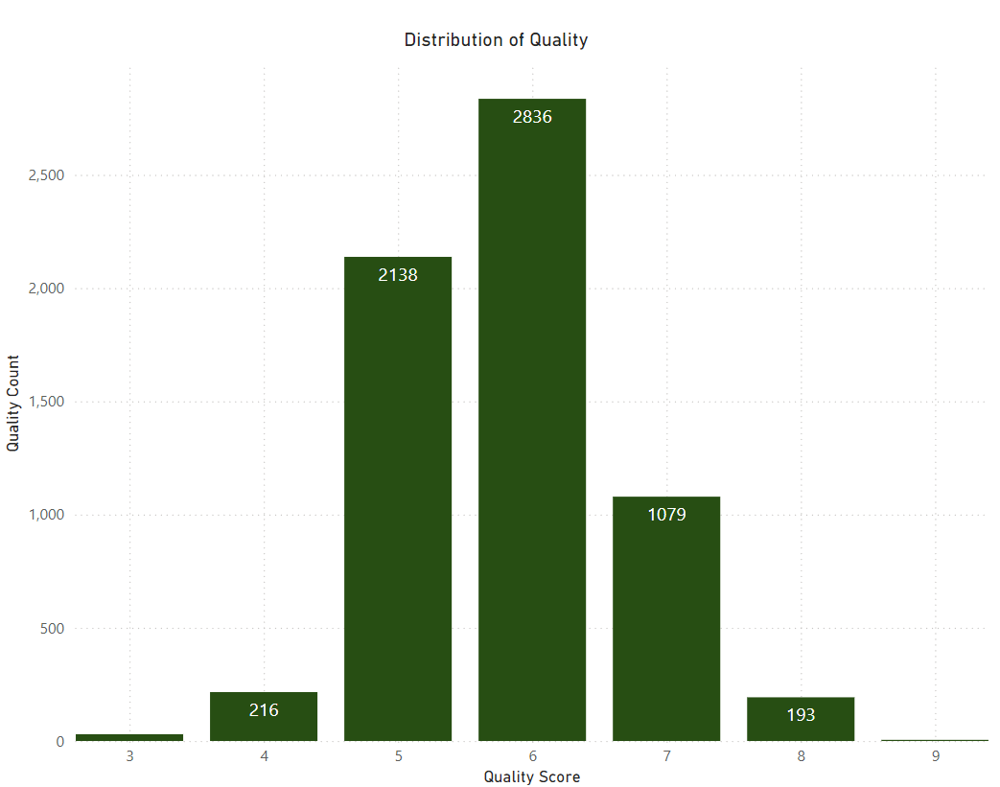
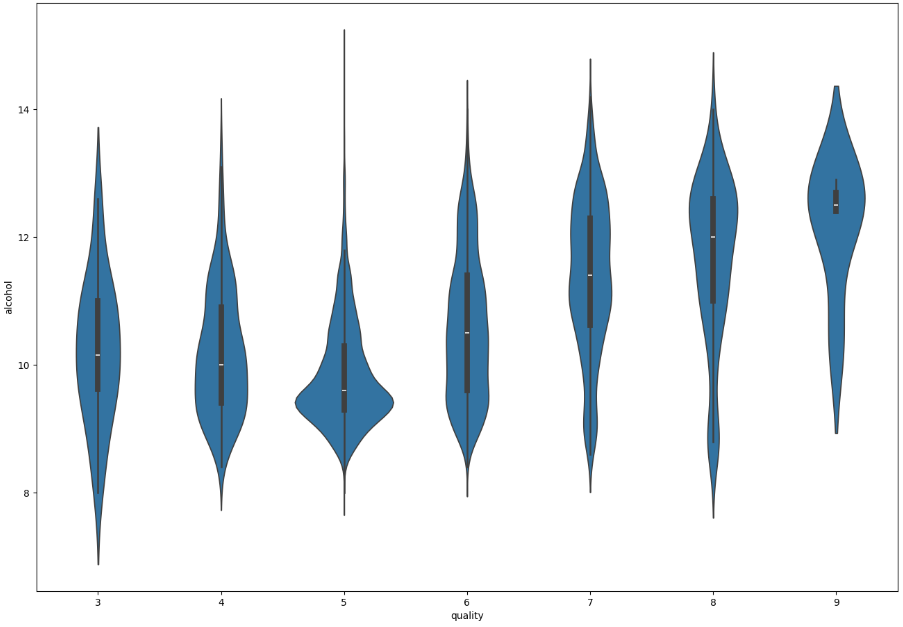

## Overview

The Wine Quality Predictor is a machine learning project aimed at predicting the quality of Vinho Verde wine (both Red and White) from Portugal's northwest region. The project encompasses data sourcing, transformation, exploratory data analysis, model training, and visualization.

## Table of Contents

1. [Introduction](#introduction)
2. [Features](#features)
3. [Data](#data)
4. [Installation](#installation)
5. [Usage](#usage)
6. [Model Training](#model-training)
7. [Evaluation](#evaluation)
8. [Results](#results)
9. [License](#license)
10. [Team](#team)
11. [References](#references)

## Introduction

This project explored using machine learning to predict the quality of Vinho Verde wine from Portugal's northwest region. It involved project ideation, data sourcing, and transformation using Excel and Python to create a usable dataframe and CSV file. Power BI was used to gather insights on the dataset and assess the feasibility of our hypothesis, followed by formatting and exploratory data analysis in Python.

## Features

- Predicts wine quality based on chemical properties
- Supports both red and white wine data
- Provides insights into which factors most influence wine quality

## Data

The dataset used in this project was sourced from Kaggle and includes two CSV files: `wine_data_white.csv` and `wine_data_red.csv`. These were combined into a single file, `wine_data_both.csv`.

The dataset contains the following columns:

- `Index`
- `fixed acidity`
- `volatile acidity`
- `citric acid`
- `residual sugar`
- `chlorides`
- `free sulfur dioxide`
- `total sulfur dioxide`
- `density`
- `pH`
- `sulphates`
- `alcohol`
- `quality`
- `Wine` (Type of wine: Red or White)

## Installation

To run this project locally, you'll need Python and additional libraries installed. Use the following command to install the required libraries:

```bash
pip install pandas numpy scikit-learn imbalanced-learn matplotlib statsmodels
```

## Usage

1. **Clone the repository:**

```bash
git clone git@github.com:N8sGit/group_project_2.git
cd group_project_2
```

2. **Prepare the data:**

Place your wine dataset CSV files (`wine_data_white.csv`, `wine_data_red.csv`, `wine_data_both.csv`) in the `data/` directory.

3. **Open the Jupyter Notebook:**

Launch Jupyter Notebook and open the notebook file (e.g., `main.ipynb`). Run all cells to execute the code.

## Model Training

To train the model, follow these steps:

1. **Open the Jupyter Notebook:**

Launch Jupyter Notebook and open the notebook file (e.g., `main.ipynb`). Run all cells to preprocess the data, train the model, and save the trained model.

## Evaluation

To evaluate the model's performance:

1. **Open the Jupyter Notebook:**

Launch Jupyter Notebook and open the notebook file (e.g., `main.ipynb`). Run all cells to evaluate the model using the test dataset.

## Results

The project involved extensive exploratory data analysis, including descriptive statistics, correlation heatmaps, box plots, histograms, violin plots, and p-value analysis (which did not provide significant results). Key steps included:

- Analyzing the 'Quality' variable for correlation and removing highly correlated variables (free sulfur dioxide and density).
- Reviewing the distribution of all variables and removing outliers for model training.

### Describe Chart


### Correlation Heatmap


### Box Plot


### Histogram Charts


### Violinplots


The key takeaway is that alcohol is the best predictor for high-quality wine using a Random Forest Model. Detailed results and visualizations can be found in the `results/` directory.

## License

This project is licensed under the MIT License. See the [LICENSE](LICENSE) file for details.

## Team

- Elizabeth Arias
- Dawn Kim
- Christian Leon
- Nathan Anecone
- Ian Cody
- Kyle Prudente

## References

- Kaggle.com: P. Cortez, A. Cerdeira, F. Almeida, T. Matos, and J. Reis. Modeling wine preferences by data mining from physicochemical properties. In Decision Support Systems, Elsevier, 47(4):547-553, 2009.

=======
## Project 2 Overview
# This project explored using Machine Learning to predict the quality of Vinho Verde wine (Red and White) from Portugal's northwest region. 

Started with project ideation, sourcing data & transforming it using excel and python to a usable dataframe and csv file. Then used Power BI to quickly gather insights on the downloaded dataset and assess the feasibility of our hypothesis. Python was used for formatting and exploratory data analysis. 

We utilized two datasets from the kaggle.com in CSV format named "wine_data_white.csv" and "wine_data_red.csv" that were combined into "wine_data_both.csv".

Github was used for code repository, presentation deck and README file. Finally built visualizations using Matplotlib. Both top-down and bottom-up approachs were adopted to define the narrative, synthesizing of information/charts, and ensuring they answer the questions we set out to address.

### Process
A data frame called "combined_data" isolates only the necessary columns and drops the 'NaN' values.
Variables kept for the analysis of this project are as follows:

- 'Index',  <br/>
- 'fixed acidity',  <br/>
- 'volatile acidity', <br/> 
- 'citric acid', <br/>
- 'residual sugar',  <br/>
- 'chlorides',  <br/>
- 'free sulfur dioxide', <br/>
- total sulfur dioxide', <br/> 
- 'density',  <br/>
- 'pH',  <br/>
- 'sulphates',  <br/>
- 'alcohol', <br/>
- 'quality' <br/>
       
Exploratory data analysis involved the following methods:
* Describe <br/>

* Correlation heatmap <br/>

* box plot <br/>

* histogram charts <br/>

* violinplots <br/>

* p-value analysis that did not provide any significant results <br/> 


The following steps were taken:
1. The target variable of 'Quality' was analyzed for correlation and highly correlated variables were removed '(Free sulfur dioxide' and 'density'.
2. The distribution of all the variables were reviewed and outliers were removed for the purposes of training the model
3.  

### Conclusion
The Key Takeaways are that alcohol is the best predictor for High quality wine using a Random Forest Model.

Dataset

### Team members
* Elizabeth Arias <br/>
* Dawn Kim <br/>
* Christian Leon <br/>
* Nathan Anecone <br/>
* Ian Cody <br/>
* Kyle Prudente <br/>

### Tools for Analysis
- Jupyter Notebook
- Google Collab
- Github
- Kaggle


### References
Kaggle.com
P. Cortez, A. Cerdeira, F. Almeida, T. Matos and J. Reis. Modeling wine preferences by data mining from physicochemical properties. In Decision Support Systems, Elsevier, 47(4):547-553, 2009.